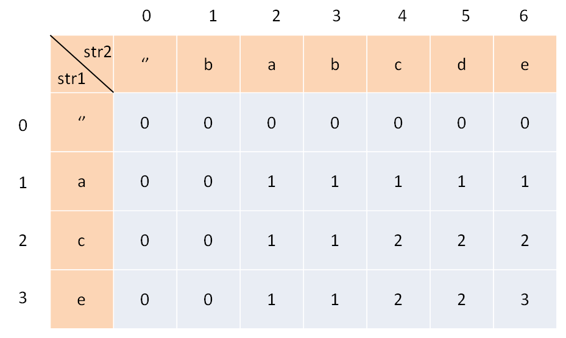

## 简介

### 1 动态规划(Dynamic Programming)

#### 1.1 基本实现思想

>参考自：https://labuladong.gitee.io/algo/1/4/

`首先，动态规划问题的一般形式就是求最值`。动态规划其实是运筹学的一种最优化方法，只不过在计算机问题上应用比较多，比如说让你求最长递增子序列呀，最小编辑距离呀等等。

既然是要求最值，核心问题是什么呢？`求解动态规划的核心问题是穷举`。因为要求最值，肯定要把所有可行的答案穷举出来，然后在其中找最值呗。

动态规划这么简单，就是穷举就完事了？我看到的动态规划问题都很难啊！

首先，动态规划的穷举有点特别，因为这类问题`存在「重叠子问题」`，如果暴力穷举的话效率会极其低下，所以需要「备忘录」或者「DP table」来优化穷举过程，避免不必要的计算。

而且，动态规划问题一定会`具备「最优子结构」`，才能通过子问题的最值得到原问题的最值。

另外，虽然动态规划的核心思想就是穷举求最值，但是问题可以千变万化，穷举所有可行解其实并不是一件容易的事，只有列出`正确的「状态转移方程」`，才能正确地穷举。

以上提到的重叠子问题、最优子结构、状态转移方程就是动态规划三要素。具体什么意思等会会举例详解，但是在实际的算法问题中，`写出状态转移方程是最困难的`，这也就是为什么很多朋友觉得动态规划问题困难的原因，我来提供我研究出来的一个思维框架，辅助你思考状态转移方程：

`明确 base case -> 明确「状态」-> 明确「选择」 -> 定义 dp 数组/函数的含义。`


## 实战演练

### 1 斐波那契数列

#### 70. 爬楼梯
[leetcode](https://leetcode-cn.com/problems/climbing-stairs/description/)

难度: `简单`

简单DP，开胃菜，不多说。

>输入：n = 2
输出：2
解释：有两种方法可以爬到楼顶。
1. 1 阶 + 1 阶
2. 2 阶

##### DP解法

**dp[i] = dp[i-1] + dp[i-2]**

```python
class Solution:
    def climbStairs(self, n: int) -> int:
        a, b, c = 0, 0, 1
        for i in range(n):
            a, b, c = b, c, b+c
        return c
```


#### 198. 打家劫舍
[leetcode](https://leetcode-cn.com/problems/house-robber/description/)

难度: `中等`

简单DP的小进阶。

>输入：[1,2,3,1]
输出：4
解释：偷窃 1 号房屋 (金额 = 1) ，然后偷窃 3 号房屋 (金额 = 3)。
     偷窃到的最高金额 = 1 + 3 = 4 。


##### DP解法

dp[i] = max(dp[i-2] + nums[i], dp[i-1])

[1,2,3,1]
[1]
[1,2]
[1,2,4]
[1,2,4,4]

[4,1,2,4]
[4]
[4,4]
[4,4,6]
[4,4,6,8]

```python
class Solution:
    def rob(self, nums: List[int]) -> int:
        a, b, c = 0, 0, 0
        for n in nums:
            c = max(a + n, b)
            a = b
            b = c
        return c
```

#### 213. 打家劫舍 II
[leetcode](https://leetcode-cn.com/problems/house-robber-ii/description/)

难度: `中等`

这题是上一题的进阶版，有一定思考上的难度，第一个和最后一个房间不能同时偷，其实就是一个环。
如何将这个特殊的问题一般化呢？其实很简单，拆成俩个普通的队列就行了。

>输入：nums = [2,3,2]
输出：3
解释：你不能先偷窃 1 号房屋（金额 = 2），然后偷窃 3 号房屋（金额 = 2）, 因为他们是相邻的。

##### DP解法

**dp[i] = dp[i-1] + dp[i-2]**
分成两个队列，如
p :[1,2,3,4,5,6,7] =
p1:[1,2,3,4,5,6] +
p2:  [2,3,4,5,6,7]
**p1=max(p1,p2)**


```python
class Solution:
    def rob(self, nums: List[int]) -> int:
        l = len(nums)
        if l <= 3:
            return max(nums) 
        def robson(start: int, end: int) -> int:
            numsson = nums[start:end]
            a,b,c = 0,0,0
            for n in numsson:
                c = max(a+n, b)
                a = b
                b = c
            return c
        return max(robson(0, l-1), robson(1, l))
```


### 2 矩阵路径

#### 64. 最小路径和
[leetcode](https://leetcode-cn.com/problems/minimum-path-sum/description/)

难度: `中等`

很简单的一种题型。


>输入：grid = [[1,3,1],[1,5,1],[4,2,1]]
输出：7
解释：因为路径 1→3→1→1→1 的总和最小。

##### DP解法

**dp[i][j] += max(dp[i-1][j], dp[i][j-1])**
note：`第1行&第1列要特殊处理`


```python
class Solution:
    def minPathSum(self, grid: List[List[int]]) -> int:
        n, m = len(grid), len(grid[0])
        for j in range(1, m):
            grid[0][j] += grid[0][j-1]
        for i in range(1, n):
            grid[i][0] += grid[i-1][0]
            for j in range(1, m):
                grid[i][j] += min(grid[i-1][j], grid[i][j-1])
        return grid[n-1][m-1]
```

#### 62. 不同路径
[leetcode](https://leetcode-cn.com/problems/unique-paths/description/)

难度: `中等`

增加信心题！


>输入：m = 3, n = 7
输出：28

##### DP解法

**dp[i][j] = dp[i-1][j] + dp[i][j-1]**


```python
class Solution:
    def uniquePaths(self, m: int, n: int) -> int:
        grid = [[0]*n]*m
        for j in range(n):
            grid[0][j] = 1
        for i in range(m):
            grid[i][0] = 1
        for i in range(1, m):
            for j in range(1, n):
                grid[i][j] = grid[i-1][j] + grid[i][j-1]
        return grid[m-1][n-1]
```


### 3 数组区间

#### 303. 区域和检索 - 数组不可变
[leetcode](https://leetcode-cn.com/problems/range-sum-query-immutable/description/)

难度: `简单`

前缀和，勿暴力。    

>输入：
["NumArray", "sumRange", "sumRange", "sumRange"]
[[[-2, 0, 3, -5, 2, -1]], [0, 2], [2, 5], [0, 5]]
输出：
[null, 1, -1, -3]
解释：
NumArray numArray = new NumArray([-2, 0, 3, -5, 2, -1]);
numArray.sumRange(0, 2); // return 1 ((-2) + 0 + 3)
numArray.sumRange(2, 5); // return -1 (3 + (-5) + 2 + (-1)) 
numArray.sumRange(0, 5); // return -3 ((-2) + 0 + 3 + (-5) + 2 + (-1))


##### DP解法

这里明显是前缀和解法。说明中提到`会多次调用sumRange方法`，所以不能直接暴力求解。


**sumRange = dp[j+1] + dp[i]**


```python
class NumArray:
    def __init__(self, nums: List[int]):
        self.sums = [0]
        for num in nums:
            self.sums.append(self.sums[-1] + num)

    def sumRange(self, i: int, j: int) -> int:
        return self.sums[j + 1] - self.sums[i]
```

#### 413. 等差数列划分
[leetcode](https://leetcode-cn.com/problems/arithmetic-slices/description/)

难度: `中等`

基础题！

<!--  -->

>输入：nums = [1,2,3,4]
输出：3
解释：nums 中有三个子等差数组：[1, 2, 3]、[2, 3, 4] 和 [1,2,3,4] 自身。

##### DP解法

简单如斯。

[0,1,2,3,4,5]
1       [0,1,2]
2       [1,2,3][0,1,2,3]
3       [2,3,4][1,2,3,4][0,1,2,3,4]
4       [3,4,5][2,3,4,5][1,2,3,4,5][0,1,2,3,4,5]
tot = 1+2+3+4=10

**dp[i] = dp[i-1] + 1**


```python
class Solution:
    def numberOfArithmeticSlices(self, nums: List[int]) -> int:
        dp = [0]*len(nums)
        cnt = 0
        for i in range(2, len(nums)):
            if nums[i] - nums[i-1] == nums[i-1] - nums[i-2]:
                dp[i] = dp[i-1] + 1
                cnt += dp[i]
        return cnt
```


### 4 分割整数

#### 343. 整数拆分
[leetcode](https://leetcode-cn.com/problems/integer-break/description/)

难度: `中等`

说实话这种题真的令人伤脑筋哦......

>输入: n = 2
输出: 1
解释: 2 = 1 + 1, 1 × 1 = 1。

##### DP解法

**确定状态转移方程**
当 i ≥ 2 时，有以下两种方案：
将 i 拆分成 j 和 i-j 的和，且 i−j 不再拆分成多个正整数，此时的乘积是 j×(i−j) ；
将 i 拆分成 j 和 i−j 的和，且 i−j 继续拆分成多个正整数，此时的乘积是 j×dp[i−j] 。
因此，当 j 固定时，有 dp[i]=max(j×(i−j),j×dp[i−j])。由于 j 的取值范围是 1 到 i−1 ，需要遍历所有的 j 得到dp[i]

-->  0, 0, 1, 2, 4, 6, 9, 12, 18, 27, 36, 54, 81


**dp[i] = max(dp[i], max(j*(i-j), j*dp[i-j]))**

>优化的状态转移方程：
dp[i]=max(2×(i−2),2×dp[i−2],3×(i−3),3×dp[i−3])
太难推导了，放弃吧，siunian！

```python
class Solution:
    def integerBreak(self, n: int) -> int: 
        dp = [0]*(n+2)
        dp[2] = 1
        dp[3] = 2
        for i in range(4, n+1):
            for j in range(2, int(i/2)+1):
                dp[i] = max(dp[i], j*(i-j), j*dp[i-j])
        return dp[n]
```


#### 279. 完全平方数
[leetcode](https://leetcode-cn.com/problems/perfect-squares/description/)

难度: `中等`

这题之前做过，重做一遍吧！

>输入：n = 12
输出：3 
解释：12 = 4 + 4 + 4

##### DP解法

1 2 3 4 5 6 7 8 9 10 11 12 13
1 2 3 1 2 3 4 2 1 2  3  3  2
^     ^         ^
1     2         3

12 = 1 + 11 = (1) + 11
12 = 2 + 10 = (1 + 1) + 10
12 = 3 + 9 = (1 + 1 + 1) + 9
12 = 4 + 8 = (4) + 8
12 = 5 + 7 = (4 + 1) + 7
12 = 6 + 6 = (4 + 1 + 1) + 6
12 = 7 + 5 = (4 + 1 + 1 + 1) + 5
12 = 8 + 4 = (4 + 4) + 4
12 = 9 + 3 = (9) + 3
12 = 10 + 2 = (9 + 1) + 2
12 = 11 + 1 = (9 + 1 + 1) + 1

可以看到，12要么以1为基础，要么以4为基础，要么以9为基础，分别对应1，2，3的平方。  
当然，这里的基础为大基础，具体还可以向下细分。

12 = 1 + 11 --> 1 + 3 = 4
12 = 4 + 8  --> 1 + 2 = 3 (min)
12 = 9 + 3  --> 1 + 3 = 4

综合就这三种情况了，看看哪个小就行了，这个是不固定的。

yy = [1, 2, 3]

**dp[x] = min(dp[x], 1+dp[x-yy*yy])**


```python
class Solution:
    def numSquares(self, n: int) -> int:
        dp = {}
        y = 1
        for x in range(1, n+1):
            if x == y*y:
                dp[x] = 1
                y = y + 1
            else:
                dp[x] = x
                for yy in range(1, y):
                    dp[x] = min(dp[x], 1 + dp[x-yy*yy])
        return dp[n]
```

#### 91. 解码方法
[leetcode](https://leetcode-cn.com/problems/decode-ways/description/)

难度: `中等`

这题我觉得应该先处理数字，然后再将数字转化成对应的字母。

>输入：s = "226"
输出：3
解释：它可以解码为 "BZ" (2 26), "VF" (22 6), 或者 "BBF" (2 2 6) 。

##### DP解法

做个测试
**2261**
+ 2
+ 2 2 / 22
+ 2 2 6 / 22 6 / 2 26
+ 2 2 6 1 / 2 2 61 / 22 6 1 / 22 61 / 2 26 1
可以发现，每一层都是上一层的演化
dp[226] = dp[22] + 6
😘 &rarr; 2 2 + 6 = 2 2 6 / 2 26
😘 &rarr; 22 + 6 = 22 6
又如：22 6 + 6 = 22 6 6 / 22 66(当然这里66不应该出现)
总之就是a b + c = a b c / a bc
要考虑最后一位是否可以与+的数组合。
2 2 / 22 --> [["2","2"],["22"]]
6 --> "6"

emmmmmmmmm 这样确实可行, 但是...复杂度太高了, 有O(n^2)了吧!!

还是看官方题解吧...


官方的思路:

```python
if s[i] != "0":
    可以单独进行解码, dp[i] += dp[i - 1]
    如: 12+(3) 12=[["1","2"],["12"]]=2
        ["1","2"] + "3" = ["1","2","3"]
        ["12"] + "3" = ["12","3"]
if s[i-1] != "0"and s[i-1]+s[i] <= 26:
    可以和前面一位组合起来进行解码(2位), dp[i] += dp[i - 2]
    如: 1+2(3) 12=[["1","2"],["12"]]=2
        ["1"] + "23" = ["1","23"]
```


```python
class Solution:
    def numDecodings(self, s: str) -> int:
        n = len(s)
        dp = [1] + [0] * n
        print(dp)
        for i in range(1, n + 1):
            if s[i - 1] != "0":
                dp[i] += dp[i - 1]
            if i > 1 and s[i - 2] != "0" and int(s[i-2:i]) <= 26:
                dp[i] += dp[i - 2]
            print(dp)
        return dp[n]
```


### 5 最长递增子序列

#### 300. 最长递增子序列
[leetcode](https://leetcode-cn.com/problems/longest-increasing-subsequence/description/)

难度: `中等`

dp的经典题型。

>输入：nums = [10,9,2,5,3,7,101,18]
输出：4
解释：最长递增子序列是 [2,3,7,101]，因此长度为 4 。

##### DP解法

先状态设计思想：依然着眼于某个上升子序列的 结尾的元素，如果 已经得到的上升子序列的结尾的数越小，那么遍历的时候后面接上一个数，会有更大的可能构成一个长度更长的上升子序列。既然结尾越小越好，我们可以记录 在长度固定的情况下，结尾最小的那个元素的数值，这样定义以后容易得到「状态转移方程」。

为了与「方法二」的状态定义区分，将状态数组命名为 tail。


```python
class Solution:
    def lengthOfLIS(self, nums: List[int]) -> int:
        size = len(nums)
        if size < 2:
            return size

        tail = [nums[0]]
        for i in range(1, size):
            if nums[i] > tail[-1]:
                tail.append(nums[i])
                continue
            left = 0
            right = len(tail) - 1
            while left < right:
                mid = (left + right) >> 1
                if tail[mid] < nums[i]:
                    left = mid + 1
                else:
                    right = mid
            tail[left] = nums[i]
        return len(tail)
```


#### 646. 最长数对链
[leetcode](https://leetcode-cn.com/problems/maximum-length-of-pair-chain/description/)

难度: `中等`

最长递增子序列的变种。

>输入：[[1,2], [2,3], [3,4]]
输出：2
解释：最长的数对链是 [1,2] -> [3,4]


##### DP解法

<< Holding Out For A Hero -- HITAK >>

这题比较怪异，用dp做属实不明智，贪心yyds。

先说dp吧，dp的话做法就和上一题一样，但是上一题要求的是上升子序列，有顺序的，从前往后，但这一题其实并不要求顺序，可以随意连接，所以我们需要先排个序。
（所以说既然都排序了，那为什么不直接用贪心，矮，就是玩~）


```python
class Solution(object): 
    def findLongestChain(self, pairs):
        pairs.sort()
        dp = [1] * len(pairs)
        for i in range(len(pairs)):
            for j in range(i):
                if pairs[j][1] < pairs[i][0]:
                    dp[i] = max(dp[i], dp[j] + 1)
        return max(dp)
```

##### 贪心解法

<< Holding Out For A Hero -- HITAK >> zhenhaoting


所以说还是用贪心吧，做法就是会议问题，按结尾时间排序，力求参与更多数量的会议。


```python
class Solution:
    def findLongestChain(self, pairs: List[List[int]]) -> int:
        pairs.sort(key=lambda c:c[1])
        tmp = -0x3f3f3f3f
        cnt = 0
        for p in pairs:
            if p[0] > tmp:
                tmp = p[1]
                cnt += 1
        return cnt
```


#### 376. 摆动序列
[leetcode](https://leetcode-cn.com/problems/wiggle-subsequence/description/)

难度: `中等`

dp的经典题型，上上题的变种问题。

这题做出了还是很简单的，但是只能超过10%...大无语，所以还是很难的，毕竟官方题解看起来很装逼...

>输入：nums = [1,7,4,9,2,5]
输出：6
解释：整个序列均为摆动序列，各元素之间的差值为 (6, -3, 5, -7, 3) 。

##### 虚假的DP解法

自己瞎写的，勉强过了，说是dp，其实我感觉像是暴力。

```python
class Solution:
    def wiggleMaxLength(self, nums: List[int]) -> int:
        size = len(nums)
        if size < 2:
            return size
        dp = [1]*size
        st = [0]*size
        for i in range(1, size):
            if nums[i]-nums[i-1] > 0:
                st[i] = 1
            elif nums[i]-nums[i-1] < 0:
                st[i] = -1
            else:
                st[i] = 0
        mx = 0
        for i in range(1, size):
            for j in range(0, i):
                if st[j] != st[i] and st[i] != 0:
                    dp[i] = max(dp[i], dp[j]+1)
            mx = max(mx, dp[i])
        return mx
```


##### 真正的DP解法

[1,17,5,10,13,15,10,5,16,8]
17 1 up = down1 + 1 = 2
5 1 up down = up17 + 1 = 3
10 1 up down up = down5 + 1 = 4
13 1 up down up up = down5 + 1 = 4
15 1 up down up up up = down5 + 1 = 4 
10 1 up down up up up down = up15 + 1 = 5
5 1 up down up up up down down = up15 + 1 = 5
16 1 up down up up up down down up = down5 + 1 = 6
8 1 up down up up up down down up down = up16 + 1 = 7 

```python
class Solution:
    def wiggleMaxLength(self, nums: List[int]) -> int:
        n = len(nums)
        if n < 2:
            return n
        
        up = down = 1
        for i in range(1, n):
            if nums[i] > nums[i - 1]:
                up = down + 1
            elif nums[i] < nums[i - 1]:
                down = up + 1
        
        return max(up, down)
```


### 6 最长公共子序列

#### 1143. 最长公共子序列
[leetcode](https://leetcode-cn.com/problems/longest-common-subsequence/description/)

难度: `中等`

dp的经典题型。

>输入：text1 = "abcde", text2 = "ace" 
输出：3  
解释：最长公共子序列是 "ace" ，它的长度为 3 。

##### DP解法

ok, 这题以前就没搞明白，这次彻底搞懂了！
举个例子吧！
对于ace和babcde两个字符串，我们需要定义一个二维的dp数组，其中dp[i][j]可以理解为i和j分别是指向两个字符串的指针，代表当期子串的位置。
比如dp[2][3]表示，ac和bab（dp数组中每个字符串前面填充一个'#'，默认第1行和第1列都为0）
dp[1][1]: a + b : #a + #b = max(#a + #, # + #b) = 0 ()
dp[1][2]: a + a : #a + #ba = (# + #b) + 1 = 1 (前面的两个字串的最长公共序列+1)
dp[1][3]: a + b : #a + #bab = max(# + #bab, #a + #ba) = max(0, 1) = 1
···
dp[3][6]: ··· = 3

具体dp数组如下所示：


```python
class Solution:
    def longestCommonSubsequence(self, text1: str, text2: str) -> int:
        m, n = len(text1), len(text2)
        dp = [[0] * (n + 1) for _ in range(m + 1)]
        # dp = [[0] * (n + 1)] * (m + 1) #错误用法，这样会导致每一行地址都一样
        print(dp)
        text1 = "#" + text1
        text2 = "#" + text2
        for i in range(1, m + 1):
            for j in range(1, n + 1):
                if text1[i] == text2[j]:
                    dp[i][j] = dp[i-1][j-1] + 1
                else:
                    dp[i][j] = max(dp[i-1][j], dp[i][j-1])
        print(dp)
        return dp[m][n]
```

发现一些自己的误区--关于定义二维数组
正确：dp = [[0] * (n + 1) for _ in range(m + 1)]
错误：dp = [[0] * (n + 1)] * (m + 1) #错误用法，这样会导致每一行地址都一样

```python
a = [[0] * 3] * 3
print(a)
a[0][0] = 1
print(a)

output:
[[0, 0, 0], [0, 0, 0], [0, 0, 0]]
[[1, 0, 0], [1, 0, 0], [1, 0, 0]]
```


### 7 背包问题

#### 416. 分割等和子集
[leetcode](https://leetcode-cn.com/problems/partition-equal-subset-sum/description/)

难度: `中等`

这种题应该考虑动态规划，但是需要对问题进行小小的简化。

>输入：nums = [1,5,11,5]
输出：true
解释：数组可以分割成 [1, 5, 5] 和 [11] 。

##### DP解法（0-1背包）

ok, 如何简化问题呢？
分成两个相等的子集其实可以理解为：sumson = sumall / 2
如：1+5+11+5=22
那我们只需要找到一个总和为11的子集就可以了。
| | | |


```python
class Solution:
    def canPartition(self, nums: List[int]) -> bool:
        size = len(nums)
        if size < 2:
            return False
        sumall = sum(nums)
        if sumall % 2 == 1:
            return False
        sumson = int(sumall / 2)
        dp = [[0] * (sumson+1) for _ in range(size+1)]
        for i in range(1, size+1):
            if nums[i-1] > sumson:
                return False
            if nums[i-1] == sumson:
                return True
            for j in range(1, nums[i-1]):
                dp[i][j] = dp[i-1][j]
            for j in range(nums[i-1], sumson+1):
                dp[i][j] = max(dp[i-1][j-nums[i-1]] + nums[i-1], dp[i-1][j])
            if dp[i][sumson] == sumson:
                return True
        return False
```

#### 494. 目标和
[leetcode](https://leetcode-cn.com/problems/target-sum/description/)

难度: `中等`

这题第一感觉是直接暴力dfs，当然得用回溯剪枝，要不铁定超时。

>输入：nums = [1,1,1,1,1], target = 3
输出：5
解释：一共有 5 种方法让最终目标和为 3 。
-1 + 1 + 1 + 1 + 1 = 3
+1 - 1 + 1 + 1 + 1 = 3
+1 + 1 - 1 + 1 + 1 = 3
+1 + 1 + 1 - 1 + 1 = 3
+1 + 1 + 1 + 1 - 1 = 3


##### DFS解法

随便举个例子，假设：
nums = [3, 2, 1]
target = 6
那么题解过程如下图所示，    


需要注意的是，cache是用来持久化的，也是为了回溯和剪枝，具体的就是上图中的(step, sum) = cntA + cntB 
`回溯`一般是用于排列组合，而不是寻找某一特定目标。

```python
class Solution:
    def findTargetSumWays(self, nums: List[int], target: int) -> int:
        size = len(nums)
        cache = {}
        def dfs(step, sum):
            if (step, sum) in cache: #如果已经再cache内了
                return cache[(step, sum)]
            if step == size: #如果到头了
                if sum == target:
                    cache[(step, sum)] = 1
                else:
                    cache[(step, sum)] = 0
                return cache[(step, sum)]
            cntA = dfs(step+1, sum+nums[step])
            cntB = dfs(step+1, sum-nums[step])
            cache[(step, sum)] = cntA + cntB
            return cache[(step, sum)]
        cnt = dfs(0, 0)
        return cnt
```


##### DP解法（0-1背包）

说实话，这题正常人也看不出来是个动态规划吧，但其实如果和上一题连在一起做的话，或许会有一些思路。
也就是说，这题也是需要将问题进行一定的转化。
记数组的元素和为sum，添加'-'号的元素之和为neg，则其余添加'+'的元素之和为sum−neg，得到的表达式的结果为:
(sum−neg)−neg=sum−2⋅neg=target
+1-2-3+6中，neg=2+3=5, sum-neg=1+6=1+2+3+6-5=7
(+)sum-neg=(+)7
(-)neg=(-)5
target=(sum-neg)-neg
neg=(sum-target)/2

问题出来了——从数组中选中若干个数，让它们之和等于neg(给它们加上'-'号)
阿哲，就不是0-1背包问题了吗？？？
干他！！！

呜呜呜，竟然不会写代码。


`注意`：状态转移方程dp[i][j] = dp[i-1][j] + dp[i-1][j-nums[i-1]]
                       不考虑this的组合数       考虑this的组合数
                                             = 删掉this大小的组合数
this指当前num

```python
class Solution:
    def findTargetSumWays(self, nums: List[int], target: int) -> int:
        size = len(nums)
        summ = sum(nums)
        if summ < target:
            return 0
        if (summ - target) %  2 == 1:
            return 0
        neg = int((sum(nums)-target)/2)
        dp = [[0]*(neg+1) for _ in range(size+1)]
        dp[0][0] = 1
        for i in range(1, size+1):
            for j in range(0, neg+1):
                dp[i][j] = dp[i-1][j]
                if j >= nums[i-1]:
                    dp[i][j] += dp[i-1][j-nums[i-1]]
        print(dp)
        return dp[size][neg]
```


#### 474. 一和零
[leetcode](https://leetcode-cn.com/problems/ones-and-zeroes/description/)

难度: `中等`

这题是三维的0-1背包问题，第一次做真的不容易啊，因为三维的没法画表格···
总之这题受益匪浅

>输入：strs = ["10", "0001", "111001", "1", "0"], m = 5, n = 3
输出：4
解释：最多有 5 个 0 和 3 个 1 的最大子集是 {"10","0001","1","0"} ，因此答案是 4 。
其他满足题意但较小的子集包括 {"0001","1"} 和 {"10","1","0"} 。{"111001"} 不满足题意，因为它含 4 个 1 ，大于 n 的值 3 。

##### DP解法（0-1背包）

考虑这题可以首先进行降维思考，我们不同时考虑0和1，就假设只有一个元素，这样就可以把他当成一个普通的0-1背包问题了。
本题要求的是`最多可以在背包里放几个（放满）`，那么如何选择呢？
无非是多一步统计'0'和'1'，然后给dp数组加一维。
一般是 dp[i][j] = max(dp[i-1][j], dp[i-1][j-zero]+1)
这里变成 dp[i][j][k] = max(dp[i-1][j][k], dp[i-1][j-zero][k-one]+1)

首先尝试用三维做一下，如下：

```python
class Solution:
    def findMaxForm(self, strs: List[str], m: int, n: int) -> int:
        size = len(strs)

        dp = [[[0]*(n+1) for _ in range(m+1)] for _ in range(size+1)]
        for i in range(1, size+1):
            zero = strs[i-1].count('0')
            one = len(strs[i-1])-zero
            for j in range(0, m+1):
                for k in range(0, n+1):
                    dp[i][j][k] = dp[i-1][j][k]
                    if j >= zero and k >= one:
                        dp[i][j][k] = max(dp[i-1][j][k], dp[i-1][j-zero][k-one]+1)
        return dp[size][m][n]
```

然但是三维太浪费空间，同时也浪费一定时间，所以可以进行空间优化。
这里可以使用滚动数组的方式，省略i这一维，但是j和k的内层循环需采用倒序遍历的方式，因为dp[j-zero][k-one]需要考虑dp[j][k]前面的数组元素，不能让前面的先被修改，应该先修改后面的元素。
同时循环遍历范围应该是range(m, zero-1, -1)和range(n, one-1, -1)，因为除此之外的范围都是保持不变的，在三维中是dp[i][j][k] = dp[i-1][j][k]，在二维中是dp[j][k] = dp[j][k]。
代码如下：

```python
class Solution:
    def findMaxForm(self, strs: List[str], m: int, n: int) -> int:
        dp = [[0]*(n+1) for _ in range(m+1)]
        for str in strs:
            zero = str.count('0')
            one = len(str)-zero
            for j in range(m, zero-1, -1):
                for k in range(n, one-1, -1):
                    dp[j][k] = max(dp[j][k], dp[j-zero][k-one]+1)
        return dp[-1][-1]
```


#### 322. 零钱兑换
[leetcode](https://leetcode-cn.com/problems/coin-change/description/)

难度: `中等`

好像做过，是0-1背包还是完全背包呢？当然是完全背包啦，毕竟一样东西可以无限的放取。

>输入：coins = [1, 2, 5], amount = 11
输出：3 
解释：11 = 5 + 5 + 1

##### DP解法（完全背包）

作为这篇blog的第一篇完全背包问题，这里还是要简单说明的。
和0-1背包不同，完全背包指的是每一样物品可以被无限次数的取走，这里有两种思路：
- 使用三层循环：for k in range(j//coins[i-1]+1)，尝试当前容量下可以取多少件当前物品（逐一尝试）。
    - 但实际上会产生很多额外操作，效率太低，也比较麻烦，不建议采用。
- 所以一般使用如0-1背包问题的二层循环，不过状态转移方程会有所变化。
    - 0-1背包：dp[i][j] = max(dp[i-1][j], dp[i-1][j-v] + w)
    - 完全背包：dp[i][j] = max(dp[i-1][j], dp[i][j-v] + w)
    - 可以看到，两者的状态转移方程只有细微的不同，但这其实就是关键之处，具体如下面两张图片所示。


这里需要说明，假设当前物品维this。
对于0-1背包而言，需要比较的是`不取this`和`取this`
对于完全背包而言，需要比较的是`不取this`和`要不要多取1个this`
<font color=red>这里多取不一定真的取多个，因为不多取这一个时的值可能也和上一层一样，只是说目前的状态允许尝试多取一个。</font>
<font color=blue>实际上，完全背包在取第1个this的时候判断是和0-1背包问题一致的，因为在此之前已经进行dp[i][j] = dp[i-1][j]的操作了。</font>


首先还是尝试不优化状态空间：`二维`

```python
class Solution:
    def coinChange(self, coins: List[int], amount: int) -> int:
        size = len(coins)
        dp = [[inf]*(amount+1) for _ in range(size+1)]
        dp[0][0] = 0
        for i in range(1, size+1):
            for j in range(amount+1):
                if j >= coins[i-1]:
                    dp[i][j] = min(dp[i-1][j], dp[i][j-coins[i-1]] + 1)
                else:
                    dp[i][j] = dp[i-1][j]
        if dp[-1][-1] == inf:
            return -1
        return dp[-1][-1]
```

然后尝试优化状态空间：`一维`

```python
class Solution:
    def coinChange(self, coins: List[int], amount: int) -> int:
        size = len(coins)
        dp = [inf]*(amount+1)
        dp[0] = 0
        for coin in coins:
            for j in range(coin, amount+1):
                dp[j] = min(dp[j], dp[j-coin]+1)
        res = dp[-1]
        return res if res != inf else -1
```

<font color=green face="STCAIYUN">花里胡哨</font>（<font color=grey>~~不是~~</font>


#### 518. 零钱兑换 II
[leetcode](https://leetcode-cn.com/problems/coin-change-2/description/)

难度: `中等`

同样是完全背包问题，不过上题问的是使用最少硬币的组合，这题问的是组合数。

>输入：amount = 5, coins = [1, 2, 5]
输出：4
解释：有四种方式可以凑成总金额：
5=5
5=2+2+1
5=2+1+1+1
5=1+1+1+1+1

##### DP解法（完全背包）


这题可以参考322. 零钱兑换 + 494. 目标和，具体就不解释了，就是完全背包+组合数


<font color=red> wuhu </font>
<font color=blue> 芜湖 </font>


首先还是尝试不优化状态空间：`二维`

```python
class Solution:
    def change(self, amount: int, coins: List[int]) -> int:
        size = len(coins)
        dp = [[0]*(amount+1) for _ in range(size+1)]
        dp[0][0] = 1
        for i in range(1, size+1):
            for j in range(0, amount+1):
                dp[i][j] = dp[i-1][j]
                if j >= coins[i-1]:
                    dp[i][j] += dp[i][j-coins[i-1]]
        return dp[-1][-1]
```

然后尝试优化状态空间：`一维`

```python
class Solution:
    def change(self, amount: int, coins: List[int]) -> int:
        size = len(coins)
        dp = [0]*(amount+1)
        dp[0] = 1
        for coin in coins:
            for j in range(coin, amount+1):
                dp[j] += dp[j-coin]
        return dp[-1]
```


#### 139. 单词拆分
[leetcode](https://leetcode.cn/problems/word-break/description/)

难度: `中等`

完全背包问题，和前面两题不一样，这题要简单点，问的是是否可以。

>输入: s = "leetcode", wordDict = ["leet", "code"]
输出: true
解释: 返回 true 因为 "leetcode" 可以由 "leet" 和 "code" 拼接成。

##### DP解法（完全背包）

思路对了就行，坑点是他有排列顺序

<font color=red> wuhu </font>

首先还是尝试不优化状态空间：`二维`

```python
class Solution:
    def change(self, amount: int, coins: List[int]) -> int:
        size = len(coins)
        dp = [[0]*(amount+1) for _ in range(size+1)]
        dp[0][0] = 1
        for i in range(1, size+1):
            for j in range(0, amount+1):
                dp[i][j] = dp[i-1][j]
                if j >= coins[i-1]:
                    dp[i][j] += dp[i][j-coins[i-1]]
        return dp[-1][-1]
```

然后尝试优化状态空间：`一维`

```python
class Solution:
    def change(self, amount: int, coins: List[int]) -> int:
        size = len(coins)
        dp = [0]*(amount+1)
        dp[0] = 1
        for coin in coins:
            for j in range(coin, amount+1):
                dp[j] += dp[j-coin]
        return dp[-1]
```

