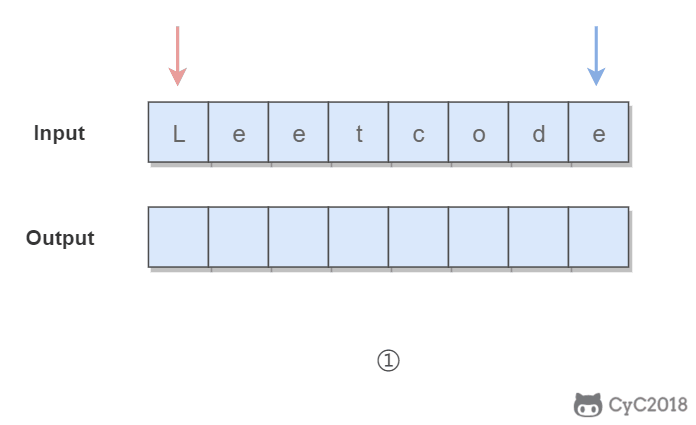
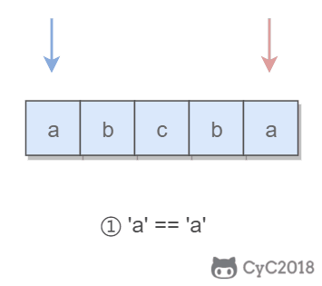

## 简介

### 1 双指针(double pointer)

双指针主要用于遍历数组，两个指针指向不同的元素，从而协同完成任务。（over）
这部分虽然没有参考cyc的思路，但是由于之前没来及写博客，所以题解思路就参考cyc的了（[cyc链接](http://www.cyc2018.xyz/%E7%AE%97%E6%B3%95/Leetcode%20%E9%A2%98%E8%A7%A3/Leetcode%20%E9%A2%98%E8%A7%A3%20-%20%E5%8F%8C%E6%8C%87%E9%92%88.html#_1-%E6%9C%89%E5%BA%8F%E6%95%B0%E7%BB%84%E7%9A%84-two-sum)）

当然，可能也会造成思路和代码不符的情况，有空慢慢改！

## 实战演练

### 1 就普通双指针啊

#### 167. 两数之和 II - 输入有序数组
[leetcode](https://leetcode-cn.com/problems/two-sum-ii-input-array-is-sorted/description/)

难度: `中等`

很多人做这个题目想不到正确的 O(N)解法，即使看了答案理解了，下次再做的时候还是会忘记。要想真正理解这道题，就要明白解法背后的道理。这样不仅可以记住这道题，还能举一反三解决类似的题目。


>输入: g = [1,2,3], s = [1,1]
输出: 1
解释: 你有三个孩子和两块小饼干，3个孩子的胃口值分别是：1,2,3。
虽然你有两块小饼干，由于他们的尺寸都是1，你只能让胃口值是1的孩子满足。
所以你应该输出1。


##### 双指针题解

使用双指针，一个指针指向值较小的元素，一个指针指向值较大的元素。指向较小元素的指针从头向尾遍历，指向较大元素的指针从尾向头遍历。

- 如果两个指针指向元素的和 sum == target，那么得到要求的结果；
- 如果 sum > target，移动较大的元素，使 sum 变小一些；
- 如果 sum < target，移动较小的元素，使 sum 变大一些。

数组中的元素最多遍历一次，时间复杂度为 O(N)。只使用了两个额外变量，空间复杂度为 O(1)。


```python
class Solution:
    def twoSum(self, numbers: List[int], target: int) -> List[int]:
        left = 0
        right = len(numbers) - 1
        while left < right :
            total = numbers[left] + numbers[right]
            if total > target :
                right -= 1
            elif total < target:
                left += 1
            else :
                return [left+1,right+1]
```

#### 633. 平方数之和
[leetcode](https://leetcode-cn.com/problems/sum-of-square-numbers/description/)

难度: `中等`

>输入：c = 5
输出：true
解释：1 * 1 + 2 * 2 = 5


##### 贪心题解

可以看成是在元素为 0~target 的有序数组中查找两个数，使得这两个数的平方和为 target，如果能找到，则返回 true，表示 target 是两个整数的平方和。

本题和 167 类似，只有一个明显区别：一个是和为 target，一个是平方和为 target。本题同样可以使用双指针得到两个数，使其平方和为 target。

本题的关键是右指针的初始化，实现剪枝，从而降低时间复杂度。设右指针为 x，左指针固定为 0，为了使 0^2 + x^2 的值尽可能接近 target，我们可以将 x 取为 sqrt(target)。

因为最多只需要遍历一次 0~sqrt(target)，所以时间复杂度为 O(sqrt(target))。又因为只使用了两个额外的变量，因此空间复杂度为 O(1)。

```python
class Solution:
    def judgeSquareSum(self, c: int) -> bool:
        left = 0
        right = sqrt(c)
        while left <= right :
            print(left,right)
            total = left**2 + right**2
            print(total)
            if total > c :
                right -= 1
            elif total < c :
                left += 1
            else :
                return True
        return False
```

#### 345. 反转字符串中的元音字母
[leetcode](https://leetcode-cn.com/problems/reverse-vowels-of-a-string/description/)

难度: `简单`


>输入：s = "hello"
输出："holle"

##### 双指针题解

使用双指针，一个指针从头向尾遍历，一个指针从尾到头遍历，当两个指针都遍历到元音字符时，交换这两个元音字符。

为了快速判断一个字符是不是元音字符，我们将全部元音字符添加到集合 HashSet 中，从而以 O(1) 的时间复杂度进行该操作。
- 时间复杂度为 O(N)：只需要遍历所有元素一次
- 空间复杂度 O(1)：只需要使用两个额外变量



```python
class Solution:
    def reverseVowels(self, s: str) -> str:
        s1 = list(s)
        print(s1)
        yy = ['a','e','i','o','u','A','E','I','O','U']
        left = 0
        right = len(s1) - 1
        while left < right :
            while s1[left] not in yy and left < right:
                left += 1
            while s1[right] not in yy and left < right:
                right -= 1
            temp = s1[left]
            s1[left] = s1[right]
            s1[right] = temp
            left += 1
            right -= 1
        return ''.join(s1)
```


#### 680. 验证回文字符串 Ⅱ
[leetcode](https://leetcode-cn.com/problems/valid-palindrome-ii/description/)

难度: `简单`

所谓的回文字符串，是指具有左右对称特点的字符串，例如 "abcba" 就是一个回文字符串。

使用双指针可以很容易判断一个字符串是否是回文字符串：令一个指针从左到右遍历，一个指针从右到左遍历，这两个指针同时移动一个位置，每次都判断两个指针指向的字符是否相同，如果都相同，字符串才是具有左右对称性质的回文字符串。



>输入: s = "aba"
输出: true


##### 双指针题解

本题的关键是处理删除一个字符。在使用双指针遍历字符串时，如果出现两个指针指向的字符不相等的情况，我们就试着删除一个字符，再判断删除完之后的字符串是否是回文字符串。

在判断是否为回文字符串时，我们不需要判断整个字符串，因为左指针左边和右指针右边的字符之前已经判断过具有对称性质，所以只需要判断中间的子字符串即可。

在试着删除字符时，我们既可以删除左指针指向的字符，也可以删除右指针指向的字符。


```python
class Solution:
    def validPalindrome(self, s: str) -> bool:
        l=0
        r=len(s)-1
        if s == s[::-1]:
            return True
        while l<r:
            if s[l]==s[r]:
                l+=1
                r-=1
            else:
                return s[l:r] == s[l:r][::-1] or s[l+1:r+1] == s[l+1:r+1][::-1]
        return True
```

#### 524. 通过删除字母匹配到字典里最长单词
[leetcode](https://leetcode-cn.com/problems/longest-word-in-dictionary-through-deleting/description/)

难度: `中等`

删除 s 中的一些字符，使得它构成字符串列表 d 中的一个字符串，找出能构成的最长字符串。如果有多个相同长度的结果，返回字典序的最小字符串。

>输入：s = "abpcplea", dictionary = ["ale","apple","monkey","plea"]
输出："apple"

##### 双指针题解

通过删除字符串 s 中的一个字符能得到字符串 t，可以认为 t 是 s 的子序列，我们可以使用双指针来判断一个字符串是否为另一个字符串的子序列。

```python
class Solution:
    def maxProfit(self, prices: List[int]) -> int:
        res = 0
        tmp = prices[0]
        for p in prices:
            if p > tmp:
                res += p - tmp
            tmp = p
        return res
```


