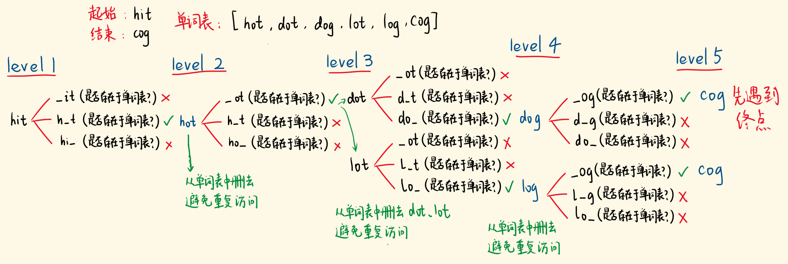
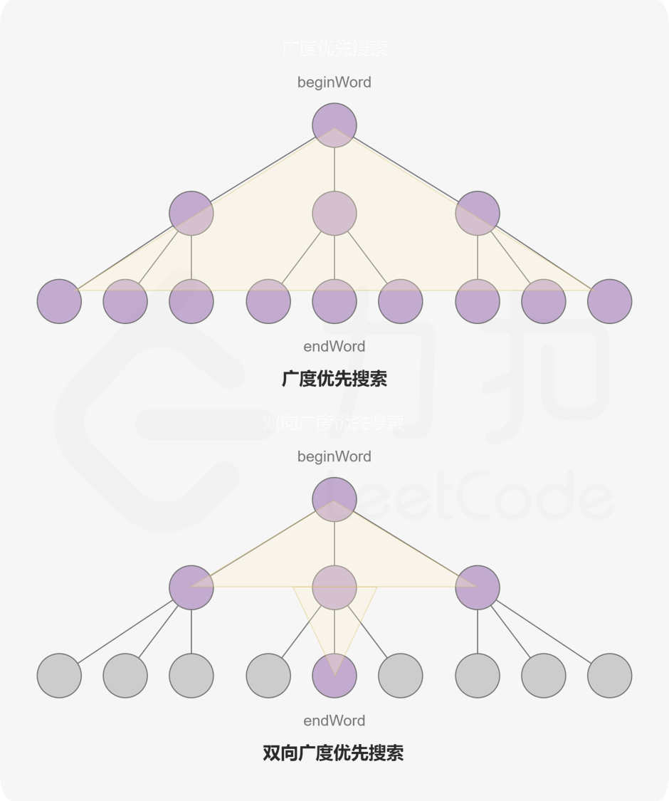
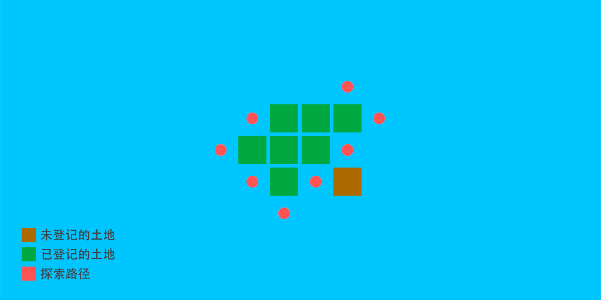
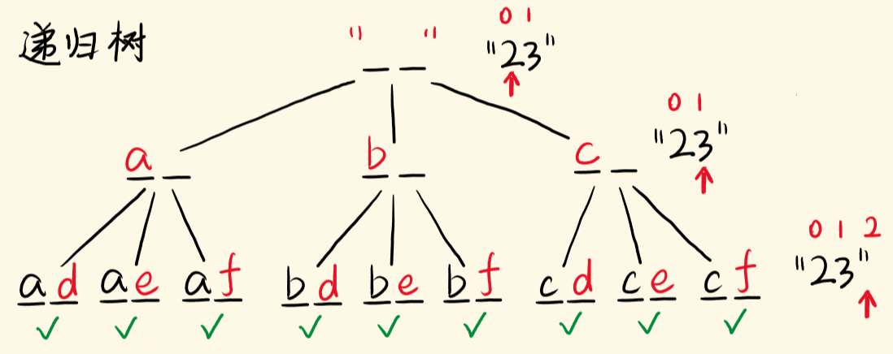

## 简介

### 1 广度优先算法BFS(Breadth First Search)

#### 1.1 基本实现思想

- （1） 顶点v入队列。
- （2） 当队列非空时则继续执行，否则算法结束。
- （3） 出队列取得队头顶点v；
- （4） 查找顶点v的所以子节点，并依次进入队列；
- （5） 转到步骤（2）。

#### 1.2 Python伪代码

```python
def BFS(root):
　　Q=[]
　　Q.append(root[0])
　　while len(Q)>0:
　　　　node=Q.pop(0)
　　　　print (node)
　　　　for i in node_child:
　　　　　　Q.append(node_child[i])
```


### 2 深度优先算法DFS(Depth First Search)

#### 2.1 基本实现思想

- （1） 访问顶点v，打印节点；
- （2） 遍历v的子节点w，while（w存在），递归执行该节点；

#### 2.2 Python伪代码

```python
def DFS(Vetex v):
    Visited[v] = true;
    for each w adjacent to v:
       　if not Visited[w]:
            DFS(w);
```


### 3 回溯(Backtracking)

#### 3.1 基本实现思想

Backtracking（回溯）属于 DFS。

- 普通 DFS 主要用在`可达性问题` ，这种问题只需要执行到特点的位置然后返回即可。
- 而 Backtracking 主要用于求解`排列组合`问题，例如有 { 'a','b','c' } 三个字符，求解所有由这三个字符排列得到的字符串，这种问题在执行到特定的位置返回之后还会继续执行求解过程。
因为 Backtracking 不是立即返回，而要继续求解，因此在程序实现时，需要注意对元素的标记问题：
- 在访问一个新元素进入新的递归调用时，需要将新元素标记为已经访问，这样才能在继续递归调用时不用重复访问该元素；
- 但是在递归返回时，需要将元素标记为未访问，因为只需要保证在一个递归链中不同时访问一个元素，可以访问已经访问过但是不在当前递归链中的元素。


## 实战演练

### 1 BFS

#### 1091. 二进制矩阵中的最短路径
[leetcode](https://leetcode-cn.com/problems/shortest-path-in-binary-matrix/)

难度: `中等`


BFS模板题，开胃菜，不多说。

>输入：grid = [[0,1],[1,0]]
输出：2

##### 普通BFS题解

思路就是BFS

```python
class Solution:
    def shortestPathBinaryMatrix(self, grid: List[List[int]]) -> int:
        if grid[0][0] != 0:
            return -1
        length = len(grid)
        if length == 1:
            return 1
        q = deque()
        visit = {}
        direct = [(-1,-1), (-1,0), (-1,1), (0,1), (1,1), (1,0), (1,-1), (0,-1)]
        q.appendleft((0,0))
        visit[(0,0)] = True
        step = 1
        while q:
            for _ in range(len(grid)):
                x, y = q.pop()
                for pos_x, pos_y in direct:
                    new_x = x + pos_x
                    new_y = y + pos_y
                    if 0 <= new_x < length and 0 <= new_y <length and grid[new_x][new_y] == 0 and not visit.get((new_x, new_y)):
                        if new_x == length - 1 and new_y == length - 1:
                            return step + 1
                        q.appendleft((new_x, new_y))
                        visit[(new_x, new_y)] = True
            step += 1
        return -1
```


#### 127. 单词接龙
[leetcode](https://leetcode-cn.com/problems/word-ladder/description/)

难度: `困难`

这题其实思路还是比较简单的，找出最短路径，其实就是广度优先搜索BFS，只不过复杂度大了点，所以我们在使用BFS的时候会发现直接超时了，但这不是问题。
因为我们有python的set()
- wordList对应的set集合，方便`O(1)`时间复杂度查找。
- python中，用set来表示一个无序不重复元素的序列。set的只要作用就是用来给数据去重。 
- 可以使用大括号`{}`或者`set()`函数创建集合，但是注意如果创建一个空集合必须用set()而不是{}，因为{}是用来表示空字典类型的。

说白了set()就是一个HashTable。

但其实更优的策略是使用双向BFS（但我发现并没有提高太大的效率，反正困难题暂时不求甚解，过了就行）（我才不是不会优化建图呢==!）

>输入：beginWord = "hit", endWord = "cog", wordList = ["hot","dot","dog","lot","log","cog"]
输出：5
解释：一个最短转换序列是 "hit" -> "hot" -> "dot" -> "dog" -> "cog", 返回它的长度 5。

##### 普通BFS题解

思路如图所示。



```python
class Solution:
    def ladderLength(self, beginWord: str, endWord: str, wordList: List[str]) -> in:
        st = set(wordList)
        if endWord not in st:
            return 0
        if beginWord == endWord:
            return 1
        que = deque()
        que.append((beginWord, 1))
        vis = set()
        vis.add(beginWord)

        length = len(beginWord)
        while que:
            word, step = que.popleft()
            if word == endWord:
                return step

            for i in range(length):
                for j in range(26):
                    tmp = word[:i] + chr(j + 97) + word[i+1:]
                    if tmp not in vis and tmp in st:
                        que.append((tmp, step + 1))
                        vis.add(tmp)
        return 0
```

##### 双向BFS题解



```python
class Solution:
    def ladderLength(self, beginWord: str, endWord: str, wordList: List[str]) -> int:
        st = set(wordList)
        if endWord not in st:
            return 0
        if beginWord == endWord:
            return 1
        lque = deque()
        rque = deque()
        lque.append(beginWord)
        rque.append(endWord)
        
        lvis = set()
        rvis = set()
        lvis.add(beginWord)
        rvis.add(endWord)

        length = len(beginWord)
        step = 0

        while lque and rque:
            if len(lque) < len(rque):
                lque, rque = rque, lque
                lvis, rvis = rvis, lvis
            step += 1

            for _ in range(len(lque)):
                word = lque.popleft()
                # if word in rvis:
                #     return step
                for i in range(length):
                    for j in range(26):
                        tmp = word[:i] + chr(j + 97) + word[i+1:]
                        if tmp not in lvis and tmp in st:
                            if tmp in rvis:
                                return step + 1
                            lque.append(tmp)
                            lvis.add(tmp)
        return 0
```

### 2 DFS

#### 695. 岛屿的最大面积
[leetcode](https://leetcode-cn.com/problems/word-ladder/description/)

难度: `中等`


这题是典型的岛类问题，其实用DFS、BFS、并查集都是可以做的。
我个人使用的DFS，因为代码量我感觉更小（可能是我菜）。

>输入：beginWord = "hit", endWord = "cog", wordList = ["hot","dot","dog","lot","log","cog"]
输出：5
解释：一个最短转换序列是 "hit" -> "hot" -> "dot" -> "dog" -> "cog", 返回它的长度 5。

##### 普通DFS题解

大概是这个样子！



遍历整个grid，对于遇到的每个`grid == 1`，都进行一次DFS，注意不需要回溯，因为访问过的就不能再次访问了。


```python
class Solution:
    def maxAreaOfIsland(self, grid: List[List[int]]) -> int:
        def dfs(grid, x, y) -> int:
            if x < 0 or y < 0 or x > len(grid) - 1 or y > len(grid[0]) - 1 or grid[x][y] != 1:
                return 0
            grid[x][y] = 0
            cnt = 1
            cnt += dfs(grid, x, y + 1)
            cnt += dfs(grid, x, y - 1)
            cnt += dfs(grid, x + 1, y)
            cnt += dfs(grid, x - 1, y)
            return cnt
        cnt = 0
        for i, line in enumerate(grid):
            for j, _ in enumerate(line):
                cnt = max(cnt, dfs(grid, i, j))
        return cnt
```

`这里用了4个单独的dfs是为了"优化"哈哈哈哈哈哈哈哈哈哈哈哈哈哈哈哈哈哈！`


#### 200. 岛屿数量
[leetcode](https://leetcode-cn.com/problems/number-of-islands/description/)

难度: `中等`

这题也是典型的岛类问题，用DFS、BFS、并查集也都是可以做的。
DFSDFSDFS!!!

>输入：grid = [
  ["1","1","1","1","0"],
  ["1","1","0","1","0"],
  ["1","1","0","0","0"],
  ["0","0","0","0","0"]
]
输出：1

##### 普通DFS题解

这个更简单了!


遍历整个grid，对于遇到的每个`grid == 1`，都进行一次DFS，也是要注意不需要回溯，因为访问过的就不能再次访问了。

其实是上一题的简化版。

例图里是`1->2`，但实际上我用的是`1->0`，岂不是更妙？


```python
class Solution:
    def numIslands(self, grid: List[List[str]]) -> int:
        def dfs(grid, x, y) -> int:
            if not 0 <= x <= len(grid) -1 or not 0 <= y <= len(grid[0]) - 1 or grid[x][y] == "0":
                return 0
            grid[x][y] = "0"
            cnt = 1
            dfs(grid, x, y + 1)
            dfs(grid, x, y - 1)
            dfs(grid, x + 1, y)
            dfs(grid, x - 1, y)
            return cnt
        cnt = 0
        for i, line in enumerate(grid):
            for j, node in enumerate(line):
                if node == "1":
                    cnt += dfs(grid, i, j)
        return cnt
```


#### 130. 被围绕的区域
[leetcode](https://leetcode-cn.com/problems/surrounded-regions/description/)

难度: `中等`

我认为啊，这道题不难，但是有陷阱，它并不是说把非边界的`O`都换成`X`，而是强调与处在边界的`O`相连的`O`其实都是不可以变的。

理解了这里，就简单多了。

>输入：board = [["X","X","X","X"],["X","O","O","X"],["X","X","O","X"],["X","O","X","X"]]
输出：[["X","X","X","X"],["X","X","X","X"],["X","X","X","X"],["X","O","X","X"]]
解释：被围绕的区间不会存在于边界上，换句话说，任何边界上的 'O' 都不会被填充为 'X'。 任何不在边界上，或不与边界上的 'O' 相连的 'O' 最终都会被填充为 'X'。如果两个元素在水平或垂直方向相邻，则称它们是“相连”的。

##### 普通DFS题解

具体思路是，把处在边界的`O`和与其相连的`O`先临时处理为`F`，然后进行遍历，遇到`O`就DFS，把所有的`O`都变成`X`。

最后别忘了把设为`F`的`O`重置回去。

```python
class Solution:
    def solve(self, board: List[List[str]]) -> None:
        def dfs(board, i, j) -> None:
            if not 0 <= i <= len(board) - 1 or not 0 <= j <= len(board[0]) - 1 or board[i][j] != 'O' :
                return
            board[i][j] = 'F'
            dfs(board, i, j + 1)
            dfs(board, i, j - 1)
            dfs(board, i + 1, j)
            dfs(board, i - 1, j)
            return

        for j in range(len(board[0])):
            dfs(board, 0, j)
            dfs(board, len(board) - 1, j)
        for i in range(len(board)):
            dfs(board, i, 0)
            dfs(board, i, len(board[0]) - 1)

        for i in range(1, len(board) - 1):
            for j in range(1, len(board[0]) - 1):
                if board[i][j] == 'O':
                    board[i][j] = 'X'
        
        for i in range(len(board)):
            for j in range(len(board[0])):
                if board[i][j] == 'F':
                    board[i][j] = 'O'
```


#### 417. 太平洋大西洋水流问题
[leetcode](https://leetcode-cn.com/problems/pacific-atlantic-water-flow/description/)

难度: `中等`


这题从正面强行做出比较困难，至少我是失败了，需要考虑的问题实在是太多了。
逆向思考一下或许更好。

>输入: heights = [[1,2,2,3,5],[3,2,3,4,4],[2,4,5,3,1],[6,7,1,4,5],[5,1,1,2,4]]
输出: [[0,4],[1,3],[1,4],[2,2],[3,0],[3,1],[4,0]]


##### 普通DFS题解

具体思路是分别从大西洋和太平洋开始，让水从低往高流。
从大西洋开始可以流到的所有地方都做一个标记，从太平洋开始可以流到的地方也做一个不同的标记，最后遍历整个小岛，两种标记都有的地方就是我们想要的地方。
`note: 这里的流到指的是水往高处流！`


```python
class Solution:
    def pacificAtlantic(self, heights: List[List[int]]) -> List[List[int]]:
        n = len(heights)
        m = len(heights[0])
        ao = [[0] * m for _ in range(n)]
        po = [[0] * m for _ in range(n)]
        def isValid(x, y):
            if 0 <= x <= n-1 and 0 <= y <= m-1:
                return True
            return False

        def dfs(heights, x, y, flag):
            if visited[x][y] == 1:
                return
            visited[x][y] = 1
            if flag == True:
                ao[x][y] = 1
            else:
                po[x][y] = 1
            for nx, ny in [(x,y+1), (x,y-1), (x+1,y), (x-1,y)]:
                if not isValid(nx, ny) or heights[nx][ny] < heights[x][y]:
                    continue
                dfs(heights, nx, ny, flag)
            return

        visited = [[0] * m for _ in range(n)]
        for y in range(m):
            dfs(heights, 0, y, True)
        for x in range(n):
            dfs(heights, x, 0, True)

        visited = [[0] * m for _ in range(n)]
        for y in range(m):
            dfs(heights, n-1, y, False)
        for x in range(n):
            dfs(heights, x, m-1, False)
        res = []
        for x in range(n):
            for y in range(m):
                if po[x][y] == 1 and ao[x][y] == 1:
                    res.append([x, y])

        return res
```


### 3 Backtracking

#### 17. 电话号码的字母组合
[leetcode](https://leetcode-cn.com/problems/letter-combinations-of-a-phone-number/)

难度: `中等`


这题是典型的排列组合问题，递归+回溯！

>输入：digits = "23"
输出：["ad","ae","af","bd","be","bf","cd","ce","cf"]

##### 回溯DFS题解

具体思路略，这里可以把list()当栈用。



```python
class Solution:
    def letterCombinations(self, digits: str) -> List[str]:
        if digits == "":
            return []
        phone = {'2':['a','b','c'],
                 '3':['d','e','f'],
                 '4':['g','h','i'],
                 '5':['j','k','l'],
                 '6':['m','n','o'],
                 '7':['p','q','r','s'],
                 '8':['t','u','v'],
                 '9':['w','x','y','z']}
        res = list()
        res_all = list()
        def dfs(step):
            if step == len(digits):
                res_all.append(''.join(res))
                return
            for ch in phone[digits[step]]:
                res.append(ch)
                dfs(step+1)
                res.pop()
            return
        dfs(0)
        return res_all
```

#### 46. 全排列
[leetcode](https://leetcode-cn.com/problems/permutations/)

难度: `中等`

这题和上一题基本一样，是典型的排列组合问题，递归+回溯！

>输入：nums = [1,2,3]
输出：[[1,2,3],[1,3,2],[2,1,3],[2,3,1],[3,1,2],[3,2,1]]

##### 回溯DFS题解

具体思路略，这里可以把list()当栈用，用set()是为了加速执行`if num not in vis:`，这是确保每一层递归不会出现重复的数字。

```python
class Solution:
    def permute(self, nums: List[int]) -> List[List[int]]:
        tmp = list()
        res = list()
        vis = set()
        def dfs(step):
            if step == len(nums):
                res.append(list(tmp))
                return
            for num in nums:
                if num not in vis:
                    tmp.append(num)
                    vis.add(num)
                    dfs(step+1)
                    tmp.pop()
                    vis.remove(num)
            return
        dfs(0)
        return res
```


#### 77. 组合
[leetcode](https://leetcode-cn.com/problems/combinations/)

难度: `中等`

需要进行一定优化的回溯问题。

>输入：n = 4, k = 2
输出：
[
  [2,4],
  [3,4],
  [2,3],
  [1,2],
  [1,3],
  [1,4],
]

##### 回溯DFS题解

优化过程：
1. 已经选择的元素个数：step;
2. 还需要的元素个数为: k - step;
3. 在集合n中至多要从该起始位置 : n - (k - step) + 1，开始遍历
注：还需要定义一个开始的坐标nn记录上一层递归所用的数


```python
class Solution:
    def combine(self, n: int, k: int) -> List[List[int]]:
        tmp = list()
        res = list()
        def dfs(step, nn):
            if step == k:
                res.append(list(tmp))
                return
            for num in range(nn + 1, n - (k - step) + 1 + 1): //剪枝优化
                tmp.append(num)
                dfs(step+1, num)
                tmp.pop()
            return
        dfs(0, 0)
        return res
```